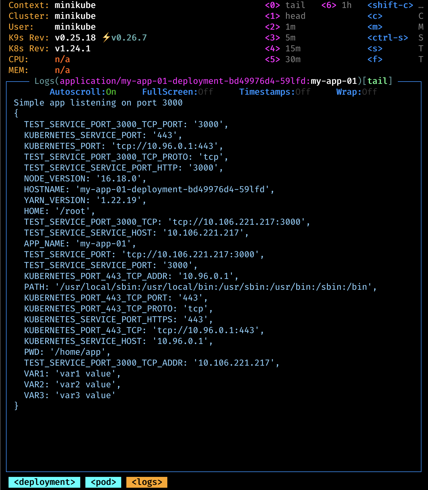
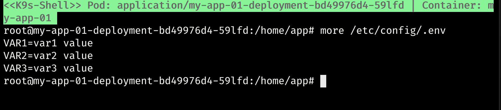

# Generate config map

In this lab we try how to automatically generate a config leveraging the `configMapGenerator` directive:
```yaml
apiVersion: kustomize.config.k8s.io/v1beta1
kind: Kustomization
configMapGenerator:
- name: application-env
  namespace: application
  files:
  - config-file/.env
resources:
- deployment.yaml

```

Looking at the output, shortened for sake a clarity, we will have get a generated config map 
having a unique name (i.e. `application-env-tc48f7cbb4`) that will be mounted at the requested path (i.e. `/etc/config`). \
Kustomize will that care of updating the reference to this config map within the deployment and this is going to trigger a rolling update of course.

```yaml
apiVersion: v1
data:
  .env: |-
    VAR1=var1 value
    VAR2=var2 value
    VAR3=var3 value
kind: ConfigMap
metadata:
  name: application-env-tc48f7cbb4
  namespace: application
---
apiVersion: apps/v1
kind: Deployment
metadata:
  annotations:
    version: 1.0.0
  name: my-app-01-deployment
  namespace: application
spec:
  ...
  template:
    spec:
      containers:
      - image: my-app-01:1.0.0
        imagePullPolicy: IfNotPresent
        name: my-app-01
        volumeMounts:
        - mountPath: /etc/config
          name: config-volume
      ...
      volumes:
      - configMap:
          name: application-env-tc48f7cbb4 
        name: config-volume
```

From the root directory we can apply against the cluster and see what ig going to happened:
```bash
make all LAB=003-generate-config-map
```

then let's port forward and hit the endpoint exposed in order to see what's going on:
```bash
curl  http://localhost:3000/hi
```

**Container log:**


**File mounted within the container as requested via Kustomize:**
