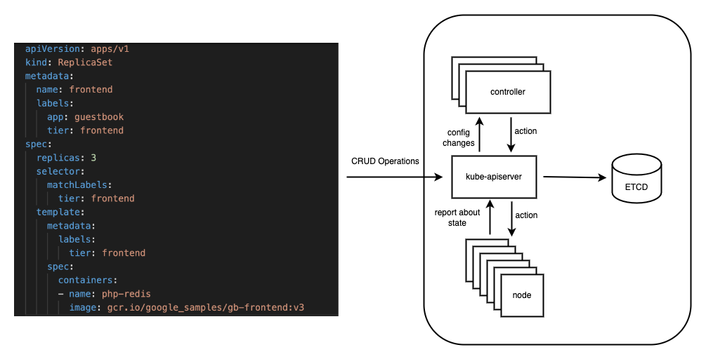

# kustomize.io, give a try

That's just a repository for my own studying purpose, meant to be a lab as well. \
I will also capture and write down some concepts. \
Whatever is written here can be definitely found [`here`](https://kustomize.io/), explained way better. \
So let's get started 😄😄.

---
***Prerequisites:***
1. [`docker`](https://www.docker.com/): docker daemon for containerization purpose
2. [`kubectl`](https://kubernetes.io/docs/tasks/tools/): docker cli
3. [`kustomize`](https://kustomize.io/)
3. [`minikube`](https://minikube.sigs.k8s.io/docs/): in order to apply against local [`kubernetes`](https://kubernetes.io/) environment
5. [`yq`](https://github.com/mikefarah/yq): [`yaml`](https://en.wikipedia.org/wiki/YAML) parser

**NOTE:**
You might alternatively use `kubectl apply -k` since with the latest kubectl versions, kustomize is built-in.

---

I have created only one `makefile` to perform operation across multiple folder (i.e. different lab/use case) so therefore we will always use [`the same one`](./Makefile). \
Just pass the LAB name, which coincides with the lab folder we wish to install against the cluster.

**Main makefile targets:** \
Chain and perform all the operation in order to install the declared app:
```bash
make all LAB=001-first-example
```

Clean up the environment (i.e. cluster stop and delete)
```bash
make clean-up LAB=001-first-example
```

## Introduction

Generally speaking we submit our resources, whichever they are, in a declarative way. \
This means that we send to the cluster the state we wish to have about a certain resource and k8s manages that, trying to match overtime the current state with the desired state. 



So in the end our infrastructure state is declared with a YAML. \
YAMLs can grow overtime in terms of number and complexity within themselves. \

`Kustomize` come into play to facilitate these aspects, making easier to reuse some manifests that change between one deployment and another (changing might also mean environment: test, staging, prod etc). \
For example modifying context information such as namespace, labels, annotations. \

At the moment there are different approaches to handle deployment:


| Methodology           | Pro  | Cons |
| --------------------- | -- | -- |
| Fork it               | Easy to understand and debug | Difficult to automate |
| Overlay and patch it  | Work in a composable fashion | Changes can be difficult to achieve |
| Parametrize it        | Good fit if we face a small set of parameters | Be wise otherwise you will end up parameterizing literally everything |

* Example of `fork it` is ... all of us 😄, I mean raise the hand who never forked an helm chart or a plain deployment and change/extend/specialize it 😄.
* [`Kustomize`](https://kustomize.io/) is classified as example of `overlay and patch`
* Example of `parametrization` is [`helm`](https://helm.sh/)

An important aspect and characteristic of kustomize is that it is template free.
No template around and variable since you inject variables from outside in fact the customization is made via overlays mechanism. \
It only generates yaml so you can pipe with kubectl cli. In essence passing its output as input for kubectl with a simple pipe mechanism. \
There is no build-in deployment mechanism. The only thing we have to do is using kustomize to produce and output and give it to kubectl.

**Labs:**

* [`First example`](./001-first-example/README.md)
* [`Adding labels and annotations`](./002-adding-labels-and-annotations/README.md)
* [`Generate configmap`](./003-generate-config-map/README.md)
* [`Using base deployment along with adding image and namespace`](./004-using-base-deployment/README.md)
* [`Patch your manifest`](./005-patch-your-manifest/README.md)
* [`Name suffix`](./006-name-suffix/README.md)
